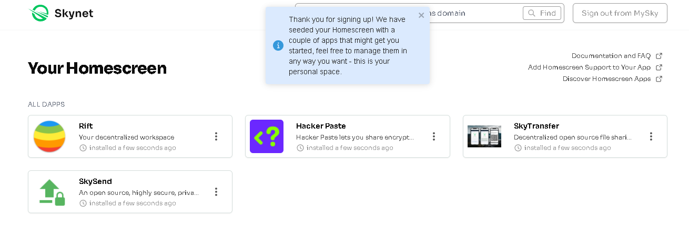
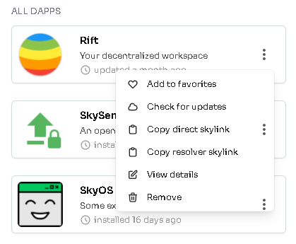
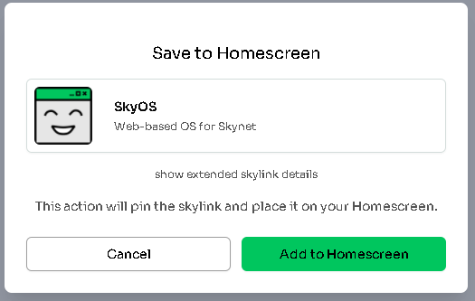
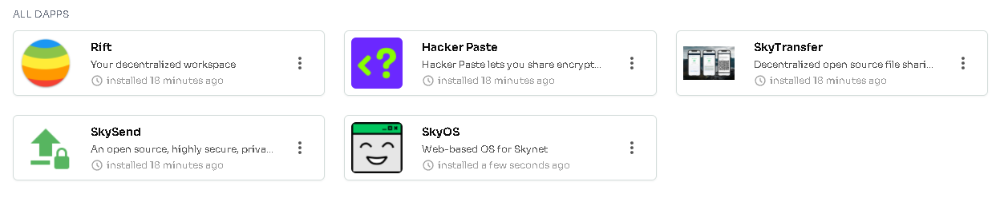

# Homescreen - Take control of your apps

Both centralized apps and DeFi have one huge weakness - the developers can stop doing things that are in best interest of own users. Most often companies make such decisions for profit. In many cases they even intentionally cripple their apps in order to offer products fixing that issue they created and sometimes they just do it because they are asked by authorities.

Many platforms started with great and honorable goals, wanted to change the word. But when they became popular, they transformed into the opposite with only goal being profit. The centralized internet is nearly completely profit driven. And users just follow because they don't have other options... or at least they don't know that there are options on the horizon.

This problem was addressed by Skynet Labs with their **Homescreen** app. It won't help you with centralized apps (decentralized alternatives need to be made) but If you ever used some DeFi app where developer changed it over night so it was useless to you, with Homescreen it won't happen again.

> Good example is when Uniswap delisted large number of assets. Everything was still in blockchain but users were accessing it through interface that was changed and refused to show those assets. It is as if you were using a calculator with numbers 0-9 and suddenly all numbers would be removed. The calculator would still have the ability to work with the numbers, but you would have no way to input them.

## What is Homescreen?

**Homescreen is application that allows users to fully decentralize their web3 frontends.** You just enter a link or name of app and it gets copied to your own personal space using your MySky decentralized identity. Whenever you then open that app from Homescreen, your own copy will load. And it doesn't matter if the developer changed the app meanwhile.

- it allows you to make copy of decentralized app and be sure that you are always using the version you trust to
- it automatically manages version control so you can upgrade/downgrade by selecting any of the versions you had previously installed
- everything works out of the box, nothing special is needed, just your MySky identity
- other applications can directly load the versions of the apps you have in Homescreen if you let them; this is very useful for apps like SkyOS that works ad kind of an operating system in your browser where you can be always sure the apps are loading from your own space and Homescreen becomes kind of an app installer for you

# Setting up Homescreen

1. Start by opening [homescreen](https://homescreen.hns.siasky.net/).hns.siasky.net and authenticate with MySky identity you created in previous guide. 
>It should log you in automatically. It is also good to check if you're logged in with your siasky.net account on the portal's page to make sure the data you create are pinned by your account. At the time of writing (Octobe 27, 2021) it is known the devs are working on solutions so this all will be absolutely effortless for users and they won't have to worry about it.

2. This is what you see when you log in for the first time. A set of few popular apps installed by default. Clicking the app's icon will open the app in a new tab.

3. Clicking the dots will open menu with more options.

> Keep in mind that when you are using apps from your Homescreen (instead of their hns domain that is under control of the app's developer), your apps will never update unless you do so by using the button `Check for updates` or adding the app again through search bar.

4. In the search bar on top you can try to search apps by name, their hns/ens domain or skylink.

5. If you enter `sky-os` in the search bar end confirm it, dialog will appear. Click `Add to Homescreen`.

6. After few moments, the newly added app is visible in your list and you can launch it from there. You can even bookmark it since it will lead directly to the same address.

If you wish, you can read more details in the [official blog](https://blog.sia.tech/announcing-homescreen-decentralized-frontends-for-web3-113a3564530d) post.

## What's next?

By now, you have everything set to start fully enjoying Skynet. You can start by checking out some of the default apps in your Homescreen or continue to the next article where we take a deeper look at other popular apps and what's in development.

---
*Written by: Danger, Last Edit: October 27, 2021*

