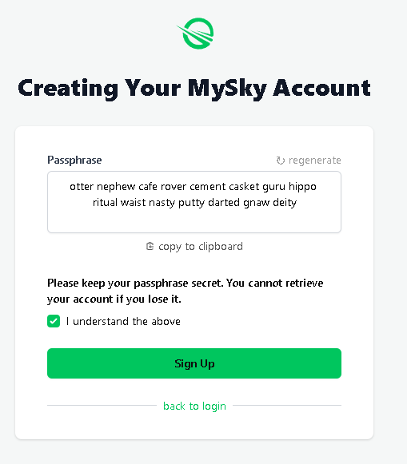

# MySky - Your decentralized identity

On the traditional internet, you have to remember hundreds if not thousands of credentials. No surprise people often use the same one or mix just few passwords. Every services forces you to make one and best the centralized internet came with was stuff like "Log in with Google" where one company has too much power. On this internet, you don't own anything. If you want to move to other service, you need to start over. There is nothing you can take with you and in many cases it's years of content and data you dedicated your time to.

Skynet fixes this and one of key technologies that helps to achieve this goal is MySky. I will quote devs here:

>MySky is a decentralized identity protocol that gives users their own empire of data within Skynet. Everything that happens inside of that empire is under control of the user but can also be visited by anyone else and shared around freely. MySky provides a standard for declaring data in a way that makes it easy for anyone in the world to discover the data. At the same time, it provides standards for protecting that data, encusring only data which is meant to be found is discoverable by others. For example, the profile information of a user like their preferred name and avatar can be placed in a shared folder, and then safely used and updated by all of the user’s applications. This tooling extends to any type of data.

Any developer can use MySky, it is not limited to decentralized applications, they can use it similarly as they use google's Sign In button, but in this case Google or Skynet devs won't own your identity - it is you who own it and the login is no set of name or password. All you need is a single seed and the rest is handled automatically. For example, when you open some app and give it access, MySky automatically handles a key derived from your seed (so your main seed serving as login is never exposed) and if you accidentally use malicious app, that app won't get anywhere outside of its scope.

Now imagine situation where credentials of 500 million users leak from Facebook. On Skynet, such leak would affect only single user and most importantly, it would be the user's fault for falling for some kind of phishing scam and giving their seed away.

If you want to learn more about MySky, about how it technically works and what additional features it has, check out this [article](https://blog.sia.tech/mysky-your-home-on-the-global-operating-system-of-the-future-5a288f89825c) on Sia's blog.

Purpose of this article is a bit different - to let you make and use one for yourself! So let's begin.

---

## Starting with MySky

You can create a seed through any MySky supported app. I personally recommend to start with Homescreen which is a Skapp (Skynet App) that we will use in the next article.

1. Open [homescreen](https://homescreen.hns.siasky.net/).hns.siasky.net.
2. Click Authenticate with MySky.

3. I will assume you don't have MySky seed yet, so continue by clicking the `sign up` button.

4. Your 15 word seed will appear (this is different format than Sia which uses 29 words). Make sure to store this seed in a safe place. It is recommended to use some password manager with multiple database backups but you can use any method you feel comfortable with. Keep in mind that if you lose your seed, you lose access to that identity.

5. Check the box and click `Sign Up`. Now you are logged in and can see list of some default decentralized apps so it's not empty. You can click some of them and see how you get logged into them automatically (if not, just click the button). And if you for example setup your profile using this popular profile Skapp (https://skyprofile.hns.siasky.net/) that many Skapps support, your public profile data will load automatically. It's as if you used Facebook for years, then switched for some new app and all your data automatically followed you.

But before we dig deeper into Homescreen in next article, there is one more thing to keep in mind.

## Making sure your data remain available

This is actually easier than it sounds. No worries, you don't need to run any software, manage any wallet or even own any coins. As you probably already know from other articles around, Skynet is a network of Skynet Portals, a special kind of Sia renter nodes, that do not store any data themselves (all your data are stored directly at the same Sia hosts where they would be if you uploaded them through Sia instead of Skynet). These portals are just access points that let you instantly upload and download data even if you're not running any node yourself. On top of that, they manage stuff like wallet with SC or file repairs so you don't have to.

Right now (October 2021) there is only one public Skynet Portal and it is operated by Skynet Labs, developer of Skynet. Actually, this site uses a load balancer and so when you are accessing siasky.net, you are connecting to one of many individual Skynet Portals. You can see very interesting stats of these servers at [siasky.tools](https://siasky.tools/). In this guide we will be using siasky.net when mentioning "portal".

By default, you can use Skynet anonymously at limited speed and for free, but your files will only stay online for 60 days, a default length of storage contracts that Skynet is forming.

If you want your files to stay permanently, you need to register account with this portal: [siasky.net](https://siasky.net/). This account has only purpose - since the portal is paying for all your uploads/downloads and pinning your files (paying for the storage) to the hosts in Siacoin, they need to know which files are meant to be pinned (to stay online for more than 60 days) and which users requested those files to be pinned. In other words, by registering here you say that you want this specific portal to keep paying for and repairing the data you uploaded because those data are precious for you.

Good thing is that you can try this completely for free, as siasky.net gives users 100 GB of capacity for free. If you cross this limit, you can still continue uploading/downloading and even the new files will stay available, but you will experience slower upload speed. That's because the storage is not free (every activity costs resources) and users that upgrade their capacity (for more storage and also speeds) are the ones who make this all possible and sustainable - because people need their data to be stored securely, need to make backups and always want to keep adding more over time.

When you register the account and log into siasky.net, all apps that you will access through this portal (for example **homescreen.hns.siasky.net**) will automatically have your files pinned and they will appear in the dashboard on siasky.net. New users are sometimes confused when they see on the dashboard also names of files they didn't upload/download but that's only because these files were downloaded or uploaded by the app. It could be for example icon, image, video or something else that was displayed on the page.

> It's also worth mentioning that the upload tool you see when going to siasky.net is not the Skynet itself. It is just uploading tool, a Skynet App, one of many, like the Homescreen above. It is a common misunderstanding that new users think that this tool is the Skynet. Couldn't be wrong more...

## What's next?

As mentioned, right now siasky.net is what we are using. There are other public portals operated by enthusiasts but we are not mentioning them because they did it for the community in the past and over time ran out of resources. If you want, you can run one for yourself and family/friends if you want, but expect something like $20/month just for the contract forming. That said, it's probably worth it if you want absolute freedom/self-control and plan to store at least few TB of data. For majority of users, public portals like siasky.net will be the way to go because of the convenient use. In future, we can expect more for-profit portals appearing with various business models. Since it is open-source, nothing stops someone from running new public portal that servers ads to the users and lets them use it completely for free. Or closed community making portal with whitelisted IPs just for their members paying some membership fee. Options are many.

And now that we know what siasky.net account is for and have our MySky identity ready, we can continue to the next part, Homescreen.

---
*Written by: Danger, Last Edit: October 27, 2021*

