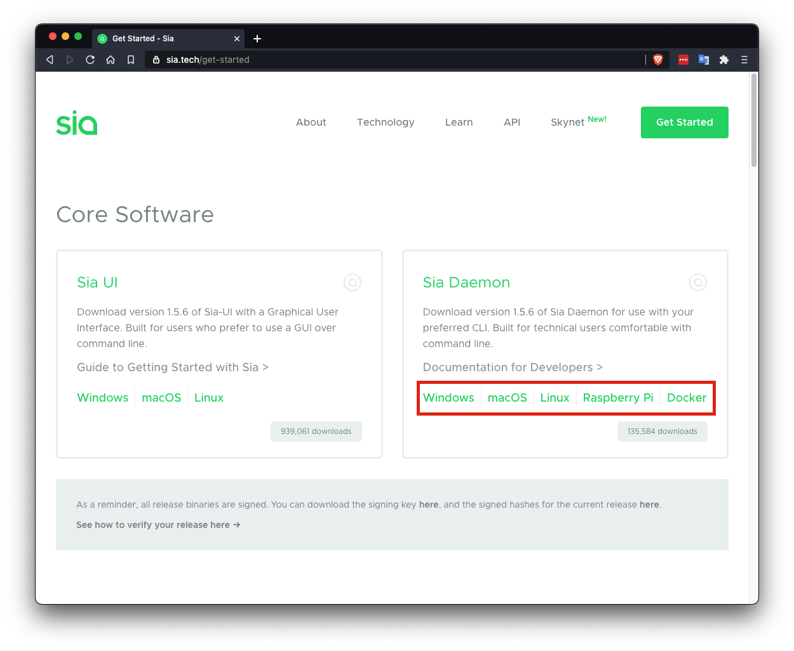

# Setting up a Sia Host on Ubuntu Server
This is a technical guide to setting up a new host from scratch on Ubuntu server using only the terminal. To learn more about the basics of Sia hosting read our [hosting guide](/hosting/index.html). This guide should be similar for any other Linux distributions.

## Getting Sia
Install the latest version of siad by going to the official website and downloading the latest zip file of Sia Daemon for your operating system from https://sia.tech/get-started. This guide has been written for v1.5.6.



You can download the files and extract them using `wget` and `unzip`
```sh
$ wget -q https://sia.tech/releases/Sia-v1.5.6-linux-amd64.zip
$ unzip Sia-v1.5.6-linux-amd64.zip
$ sudo mv -t /usr/local/bin Sia-v1.5.6-linux-amd64/siad Sia-v1.5.6-linux-amd64/siac
$ rm -rf Sia-v1.5.6-linux-amd64.zip Sia-v1.5.6-linux-amd64
```

## Creating a system service
By creating a systemd file we can start Sia whenever the server is booted instead of starting it manually. Run the following command to create a new systemd unit file:
```sh
$ sudo nano /etc/systemd/system/siad.service
```

Then, modify the following snippet to fit your host and then paste it into the file. You will want to change `asecurewalletpassword` to a more secure wallet password.

```
Description=siad
After=network.target

[Service]
Type=simple
ExecStart=/usr/local/bin/siad -M gctwh -d /home/ubuntu/siad
ExecStop=/usr/local/bin/siac stop
Restart=always
RestartSec=15
User=ubuntu 
Environment="SIA_WALLET_PASSWORD=asecurewalletpassword"

[Install]
WantedBy=multi-user.target
Alias=siad.service
```

```sh
$ sudo systemctl start siad
$ sudo systemctl enable siad
```

Your Sia node should now be running and accessible. You can try out a few commands to test it:

```sh
$ siac consensus
Synced: No
Height: 0
Progress (estimated): 0.0%
```

```sh
$ siac gateway
Address: localhost:9981
Active peers: 0
Max download speed: 0
Max upload speed: 0
```

## Creating a Wallet
You should now create a wallet. You will need the password you set in your systemd unit earlier. I will be using `asecurewalletpassword`. Wallet seeds should not be shared between hosts, so we will be generating a new recovery seed. When prompted type in the wallet password you chose. 

```
$ siac wallet init -p 
```
```    
Wallet password: 
Confirm: 
Recovery seed:
sneeze toyed nerves soothe imbalance bite maps inquest obnoxious sovereign hydrogen pact quick sipped scoop language gossip acquire western dwelt hairy fossil goodbye hills dyslexic sword tossed psychic

Wallet encrypted with given password
```

A new 29 word wallet seed will be generated. Save this seed somewhere secure, if something happens to your server you will need it to recover your Siacoin. [Secure Seed Management](/sia/seed-management/index.html)

You should now unlock your wallet with. In the future, when starting Sia your wallet will automatically unlock.
```
$ siac wallet unlock
```

The last step is to generate an address to send Siacoin to:
```sh
$ siac wallet address
Created new address: b96540b9eb96424827fe4d65bb618201c90eb2096908442746e6f29553159b4bf70a030f8cf9
```

You can now send Siacoin to this address to fund your host, however the funds will not show up until you are fully synced. 

Hosts need Siacoin to form contracts, post collateral, and provide storage proofs. It is important to keep at least a little balance in your wallet at all times. Around $10 USD in Siacoin is enough to get started, but you may need to add more as it gets locked into storage collateral.

## Wait for Sync
Now we need to wait for our host to fully synchronize we can check progress with the following command:

```
$ siac consensus
Synced: No
Height: 34030
Progress (estimated): 10.8%
```

## Add Storage Folders
Now you can add storage folders. I am going to assume that any external drives are already mounted and formatted. I am going to be adding a 1TB folder mounted at `/mnt/data`

```
$ mkdir -p /mnt/data/sia/storage01
$ siac host folder add /mnt/data/sia/storage01 1TB
```

## Set Pricing
I am going to be setting my host's storage price to `85 SC/Tb/mo` (around $1.50 USD), download price to `170 SC/Tb` (around $3.00 USD), and collateral to `170 SC/Tb/mo` (`2x storage price`). Due to a bug, I will also be setting my collateral budget to `100KS`. You can see all of the configuration options by typing `siac host config --help`

```
$ siac host config minstorageprice 85SC
$ siac host config mindownloadbandwidthprice 170SC
$ siac host config minuploadbandwidthprice 0H
$ siac host config collateral 170SC
$ siac host config collateralbudget 100KS
```

## Setup Host Registry (Optional)
The Skynet registry is a key value store for storing really small data. The host does not have to post collateral for data stored in the registry, so there's no risk of losing money if you lose the stored data. It is completely optional to enable.

Pricing is based on your storage and bandwidth prices. Updating a registry key costs the renter 5 years of storage + bandwidth. Reading a registry entry costs the renter the equivalent of 10 years of storage + bandwidth.

The recommended registry size is 4GB, it is stored with your consensus data.

```
$ siac host config registrysize 4GB
```

## Forward ports
If you have a firewall or router you will need to forward/open TCP ports 9981-9983. How to do so is outside of the scope of this guide, there are tutorials available for most routers/firewalls available on Google.

## Announcing
Now that you have setup your host, all that is left is to announce. Most hosts like to setup a custom DNS for their hosts such as `host.siacentral.host:9982`. If you have a dynamic IP, it is recommended to use a dynamic DNS service to update your IP automatically when it changes. Substitute your domain or IP in the following command:
```
$ siac host announce your.ip.or.netaddress:9982
```

Announcements can take between 20 minutes to an hour to be confirmed. Once your announcement is confirmed you can check your host using 
[Sia Central's Host Troubleshooter](https://troubleshoot.siacentral.com) or [SiaStat's Host Monitor](https://siastats.info/hosts)

## Using siac
`siac` is the utility used to interact with a running Sia node you can list commands available or get usage information by adding `--help` to the end of any command:
```
$ siac wallet --help
$ siac host --help
$ siac host folder --help
```

## Updating Your Host
It is important to keep your host up to date. To update:
1. Download and unzip the latest release from https://sia.tech/get-started
2. Stop the siad service with `sudo systemctl stop siad`
3. Replace the `siad` and `siac` binaries at `/usr/local/bin`
4. Start the siad service `sudo systemctl start siad`

## Host Monitoring (Optional)
You can optionally install Sia Central's Host Dashboard to monitor your host's financials using a convenient web interface: https://github.com/siacentral/sia-host-dashboard