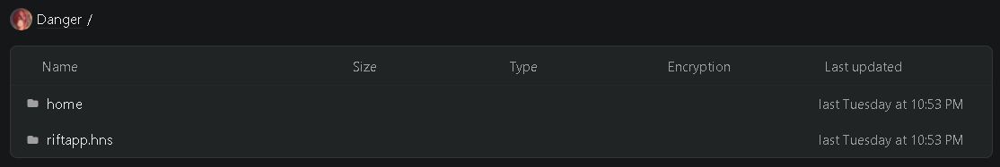
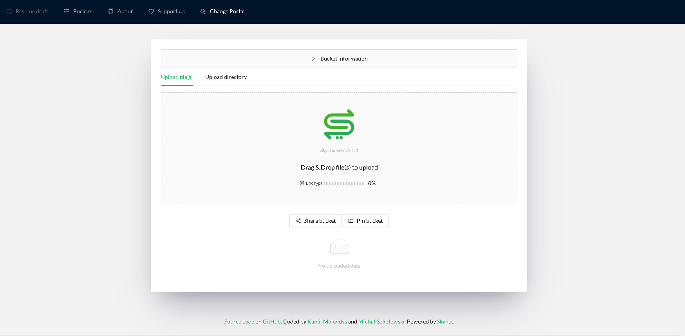
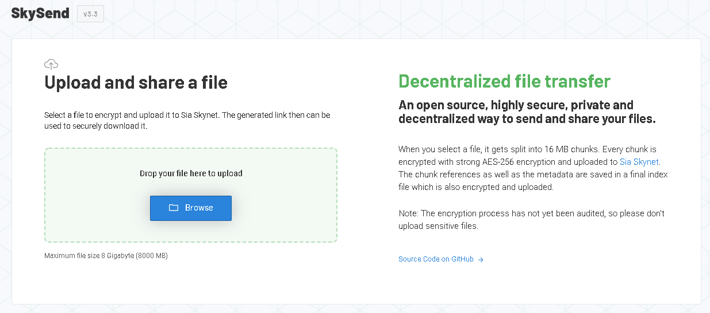
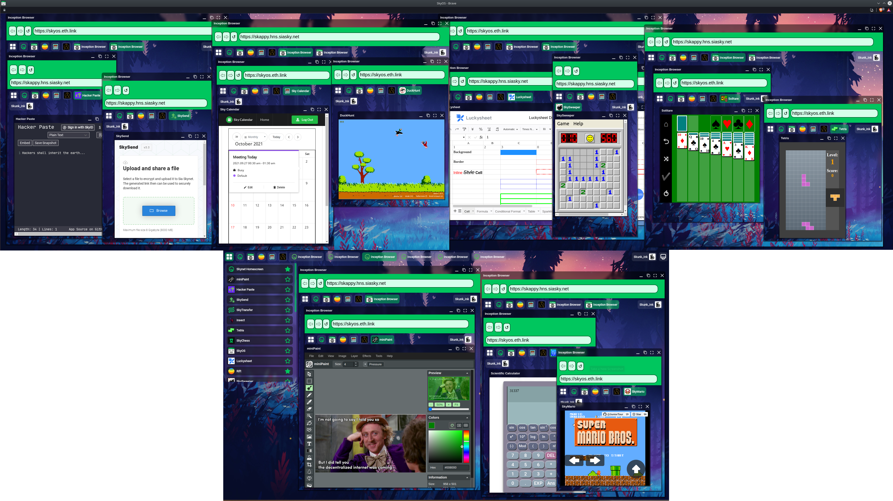
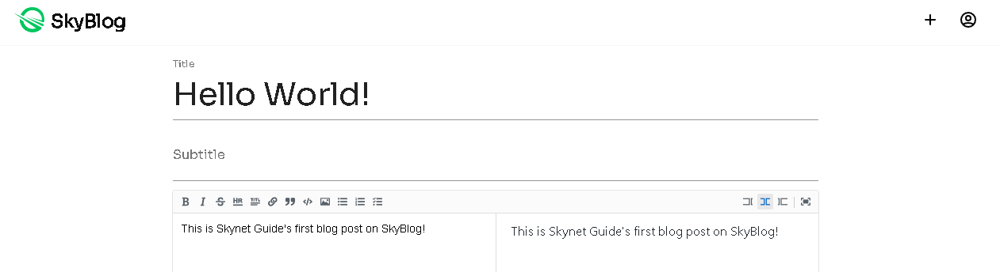
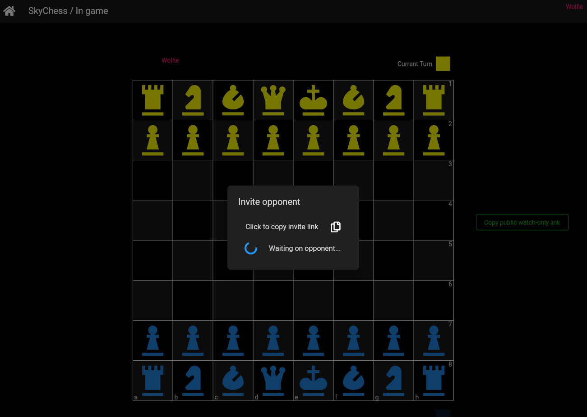

# Popular Skynet Apps

> Only apps supporting MySky are mentioned below. If you are looking for more apps, check out [AppSky](https://appsky.hns.siasky.net).

As you already know about how to use MySky, make sure your files are pinned and can make and run own copies and versions of apps you like with Homescreen, the only thing left is the most important one - what apps can you actually use? Let's look at some quickly in this overview and if you want to learn more, we plan to add dedicated guides focused on single apps and use cases over time. So let's begin...

Quick Links:

- [Rift](#rift) - complete workspace (documents, file sharing, social feeds, search engine, video streaming)
- [SkyProfile](#skyprofile) - profile management
- [SkyTransfer](#skytransfer) - file sharing
- [SkySend](#skysend) - file sharing
- [Inception Browser](#inception-browser) - browser in a browser in a browser...
- [Sky Gallery](#sky-gallery) - photo collections
- [SkyBlog](#skyblog) - blogging app
- [Sky Calendar](#sky-calendar) - calendar
- [SkyChess](#skychess) - chess (multiplayer)

---

&nbsp;

## Rift 
### Your decentralized Workspace

> [RiftApp](https://riftapp.hns.siasky.net).hns.siasky.net > [**Add to Homescreen**](https://homescreen.hns.siasky.net/#/skylink/EAAyLXjjcF4BdXVfsnHblPgpBPHSa5HDA3X57Fb3asfrrg)

---

This is one of the most powerful Skynet apps today. Developed by `parox`, it lets you:
- make posts and follow other users - `Home`
- search for users, skylinks and topics of your interest (including Reddit subs) and make the new posts appear in your feed
- configure your own algorithm/keywords so you won't miss stuff you really want to know about
- manage your documents including rich formatting options - `Docs`
- upload and share files - `Uploads`
- explore and manage your Hidden and Discoverable data on Skynet - `Data`
- manage resolver skylinks - `Dns`
- and there are always new feature the developer keeps working on (so this article can become outdated pretty fast)

**But most importantly, it has section you will absolutely love - `Files`.**

Files are utilizing latest addition (October 27, 2021) to cool set of tools you can work with on Skynet, `FS DAC` (File System DAC) developed by `redsolver`. It allows you to manage your own library, a collection of data that together with everything else (the app itself) exist purely on Skynet. You can upload Photos, Videos, Music, Apps, anything you want and use it privately (though sharing is on the way).

First thing you will notice are `home` and `riftapp.hns` folders. While the second is accessible only through Rift itself, the `home` folder can be accessed by any app you give access. This opens room for using different apps for different things. Right now, we don't have app for everything, but some are in the development by Skynet community and others will be made over time. You can have this one big library that belongs to you and then use some app as a music player that is accessing `home / music / dubstep` for example, or you can have another app running in browser on TV or your child's tablet that is accessing `home / movies / kids`. While we are not far from being able to do that (and as soon as it's possible, you will surely find a dedicated guide in our guide section), Rift itself can already play some most common formats.

If you want to start building your library, easiest you can do is just go inside the `home` folder and click `Create Directory` in top right corner. Name it `Photos` for example, go inside and drag some photos there to start the upload process. You will know that it works as the row will turn into progress bar being filled with green. One advice - don't close the window if it looks like nothing is happening. Small files are uploaded quickly, but if you're trying bigger ones (like 2 GB), the progress bar updates every 40 MB.

> Dedicated guide for Rift users coming soon...

> [**Add Rift to Homescreen**](https://homescreen.hns.siasky.net/#/skylink/EAAyLXjjcF4BdXVfsnHblPgpBPHSa5HDA3X57Fb3asfrrg)

---

&nbsp;

## SkyProfile
### Make your profile once and have it loaded everywhere

> [SkyProfile](https://skyprofile.hns.siasky.net).hns.siasky.net

This app was already shown in previous article in detail. On centralized internet, your data are stored in isolated silos and when you register, each sites just duplicates information that you already entered on hundreds of other sites. The problem is that you don't own the data and the result is that it's complete chaos. In many cases you can't even select a name you want because it's already taken.

Well, it doesn't matter anymore.

SkyProfile is not some magical profile service, all it does is just definition of profile data structure and showing you some values to set. When you are done with editing, it just saves these data in your own public space. The data are yours but other apps can read them.

Did I say it's not magical? I lied. Using it and being able to see my picture and name in other apps the first time I open them? That is like magic!

---

&nbsp;

## SkyTransfer

### Upload files and folders... and manage content with BUCKETS!

> [SkyTransfer](https://skytransfer.hns.siasky.net).hns.siasky.net

SkyTransfer is being developed by `Kamil Molendys` and `Michał Sokołowski`.

SkyTransfer is an open source decentralized file sharing platform. Do you have difficulty sharing files with others or between different devices? Are you writing an email and you need to attach files? Are you struggling with a ton of pictures to share? Try doing it using SkyTransfer. Use the minimal but powerful uploader (file picker or drag&drop) for uploading and sharing one or multiple files with a single link or QR code.

Uploaded files are encrypted using the sodium crypto library compiled to WebAssembly and pure JavaScript: no one can access them without your permission. Only by sharing the bucket link, other people can download and decrypt the content you uploaded. In addition, by sharing a draft, people can continue uploading more data into the same bucket. Be careful when you share a draft!

SkyTransfer supports uploading entire directories.

Last but not least, using MySky you can access buckets, SkyTransfer's most advanced feature. Buckets are like folders in which files are stored. Before a collection of files can be uploaded, a bucket must first be created.

SkyTransfer is still in development. Please report any bug or new idea by opening an issue on GitHub and keep in mind that the encryption process has not yet been audited.

---

&nbsp;

## SkySend

### Simple, end-to-end encrypted file-sharing on Skynet

> [SkySend](https://skysend.hns.siasky.net).hns.siasky.net

SkySend is another great tool developed by `redsolver`. It basically works like Firefox Send. You select a file, it gets encrypted locally and then uploaded to Skynet. Then you get a link which can be shared and contains the decryption key.

---

&nbsp;

## Inception Browser

### A web-browser inside of a web-browser… inside of a web-browser?

> [Webception](https://inception-browser.hns.siasky.net).hns.siasky.net

Inception Browser is developed by `Skunk_Ink` and everything you see on the picture runs inside a single browser tab running SkyOS (if you missed it, check previous article). Ever had issue with all your open tabs and want to use your screen space more effectively? Are you making market chart analysis and don't know how to show your streamers 30 charts at once? Then this is app for you.

---

&nbsp;

## Sky Gallery

### Create and browse photo albums

> [SkyGallery](https://skygallery.hns.siasky.net).hns.siasky.net

Developed by `Delivator`, Sky Gallery lets you manage your albums and share them, or even create public ones that anyone can contribute to.

---

&nbsp;

## SkyBlog

### Share your story using the deecentralized internet

> [10007eqr24h29nibtb7rbbu0fntk99mp84vfccpf3sh52rpqjt6msk8](https://10007eqr24h29nibtb7rbbu0fntk99mp84vfccpf3sh52rpqjt6msk8.siasky.net).siasky.net

SkyBlog is a good example of an app that does exactly what you expect it to do - to create and manage your own blog. The main difference from traditional solutions is that since it uses Skynet and your MySky, all data belong to you.

---

&nbsp;

## Sky Calendar

### Decentralized calendar? Yes!

> [1004d71nji71jeqpu6f5jsg2gk0ddhh2u2ha6pm7d3ml2ikv1kqeh38](https://1004d71nji71jeqpu6f5jsg2gk0ddhh2u2ha6pm7d3ml2ikv1kqeh38.siasky.net).siasky.net

Everything you expect from a calendar, "just" decentralized. Screenshot does better job here than 1000 words, check for yourself.

---

&nbsp;

## SkyChess

> [SkyChess](https://skychess.hns.siasky.net).hns.siasky.net

Developed by `redsolver`, SkyChess = Decentralized Multiplayer Chess on Skynet.

Features:
- Play chess games online in real-time (1 second latency on average)
- See the Profile of your opponent when he is logged in using MySky
- Play even if you're not logged into MySky
- Only legal moves can be played
- Openings are automatically detected
- Publish played games using the Feed DAC
- Browse played games published by other users
- Browse your own played games
- Watch games live using the special watch-only link

---
*Written by: Danger, Last Edit: October 29, 2021*
